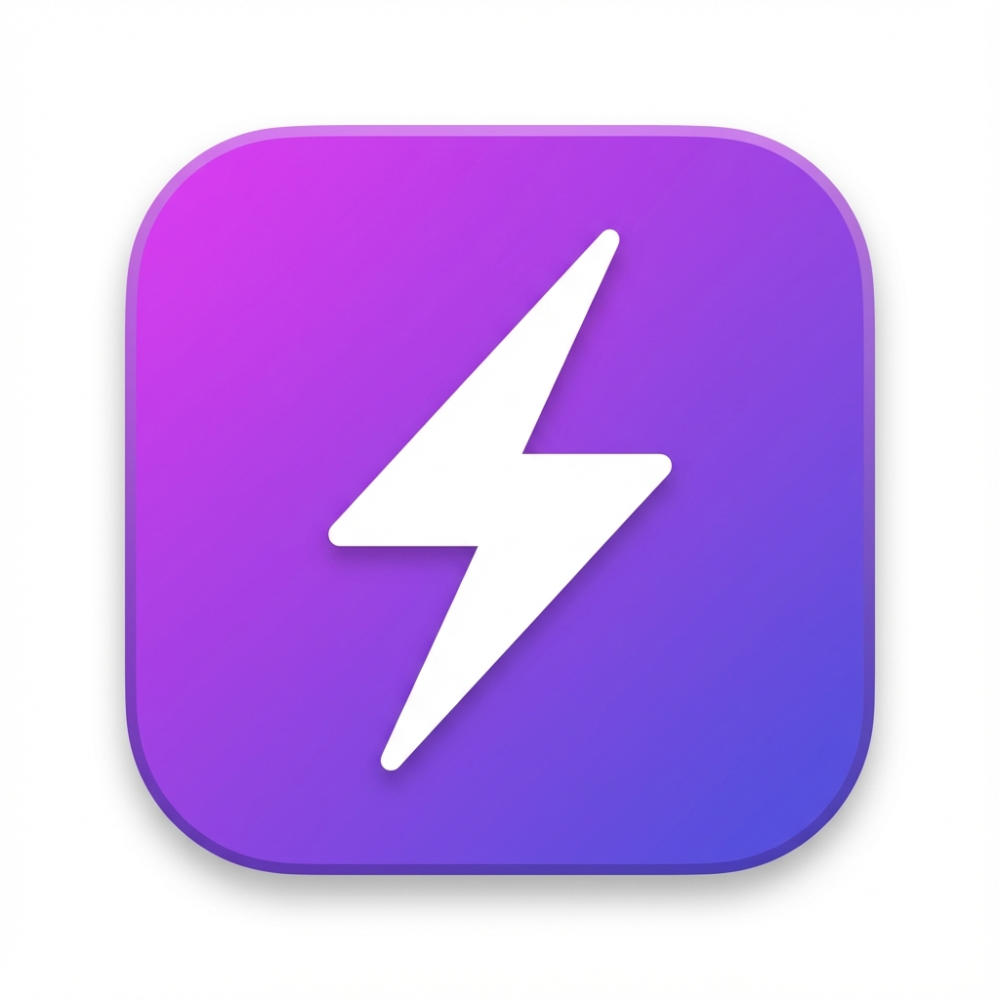

# ⚡ forDev - The Privacy-First Developer News Feed

**The daily.dev alternative you've been waiting for.**

---

**forDev** is a beautiful, clutter-free new tab page for developers who value privacy and performance. We believe developer news should be accessible, fast, and free from distractions.

> "No login, no clutter, no ads. Just the news you care about."

## 💡 The Philosophy

We were tired of bloated news aggregators that prioritize engagement algorithms over content. We were tired of "Sign up to read more" popups. We were tired of waiting for heavy React apps to load just to see a headline.

**So we built the alternative.**

forDev is built on three core pillars:
1.  **Respect**: We respect your time and your data. No tracking, no paywalls.
2.  **Performance**: We use vanilla technologies because a new tab page should load instantly.
3.  **Simplicity**: We strip away the noise so you can focus on the signal.

## ✨ Why Switch to forDev?

- 🚫 **No Login Required** - Install and start reading immediately. No accounts, no tracking.
- 🧹 **Zero Clutter** - A clean, focused interface designed for reading, not engagement metrics.
- 🛡️ **Privacy First** - Your data stays on your device. We don't track your reading habits.
- ⚡ **Blazing Fast** - Built with performance in mind. No heavy frameworks or bloat.
- 🔓 **Open Source** - Transparent and community-driven.
- 🎨 **Sleek Dark UI** - A modern, deep-dark theme that's easy on the eyes. Inspired by the best.

## 📰 Current Sources

- **Hacker News** (Top, Best, New, Show HN, Ask HN)
- *More coming soon...*

## � The Future

We are just getting started. **forDev** is evolving into the ultimate open-source hub for developer knowledge. We're building a community-driven platform where *you* decide the roadmap. New sources, custom themes, and deeper integrations are on the horizon.

## 🤝 Join the Revolution

This project is open source for a reason. We want **you** to help shape the future of developer news.

- **Star the repo** if you believe in the mission.
- **Fork it** and build the feature you've always wanted.
- **Share it** with your team.

## �🚀 Installation (Chrome / Edge / Brave)

1. **Download** this repository.
2. Open your browser's extensions page (`chrome://extensions/`).
3. Enable **Developer mode** (toggle in top right).
4. Click **"Load unpacked"**.
5. Select the `forDev` folder.
6. Open a new tab and enjoy!

## ⌨️ Keyboard Shortcuts

| Shortcut | Action |
|----------|--------|
| `R` | Refresh feed |
| `Grid Click` | Open article |

## 🛠️ Tech Stack

- **Vanilla HTML/CSS/JS** - No build steps, no complex dependencies.
- **Hacker News API** - Real-time data.

## 📄 License

MIT License - Free and Open Source for everyone.

---

    Built with ❤️ for the developer community.

